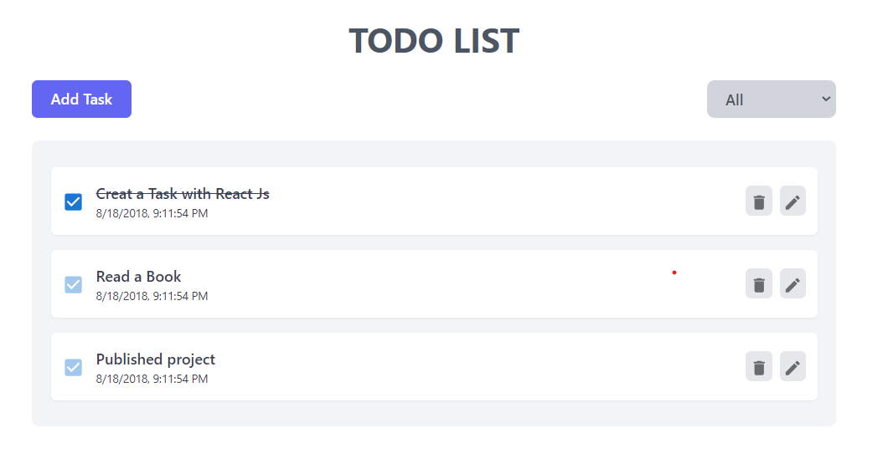

# ToDo-app-React

## Description

ToDo-app-React is a simple and intuitive task management application built with React. It allows users to efficiently manage their daily tasks by adding, editing, deleting, and marking tasks as complete. The app also provides filtering options to view tasks based on their status (All, Incomplete, Complete). With a responsive design, the app ensures a seamless experience across both desktop and mobile devices. Additionally, users can switch between dark mode and light mode for a comfortable viewing experience.

# demo



## Features

- **Add Tasks**: Easily add new tasks with a simple and intuitive interface.
- **Edit Tasks**: Modify existing tasks to update their details.
- **Delete Tasks**: Remove tasks that are no longer needed.
- **Mark as Complete**: Mark tasks as complete to keep track of your progress.
- **Filter Tasks**: Filter tasks by their status (All, Incomplete, Complete) to quickly find what you're looking for.
- **Responsive Design**: The app is fully responsive and works well on both desktop and mobile devices.

# technology use

- **React**: A JavaScript library for building user interfaces.
- **Tailwind CSS**: A utility-first CSS framework for rapid UI development.
- **JavaScript**: The programming language used for the app's logic.
- **HTML5**: The standard markup language for creating web pages.
- **CSS3**: The style sheet language used for describing the presentation of the app.

# Project Structure

- `src/components`: Contains all the React components.
- `src/App.js`: The main application component.
- `public/index.html`: The entry point for the application.

## Setup

To set up the project locally, follow these steps:

1. Clone the repository to your local machine.
2. Navigate to the project directory.
3. Run `npm install` to install the necessary dependencies.
4. Run `npm start` to start the development server.

## Run Code

After setting up the project, you can run it locally by executing:

```bash
npm start
```
